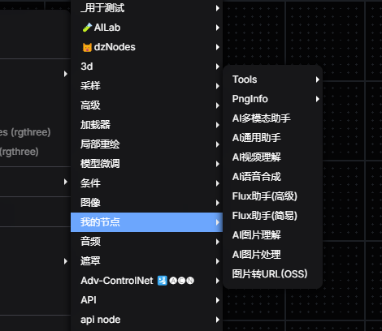
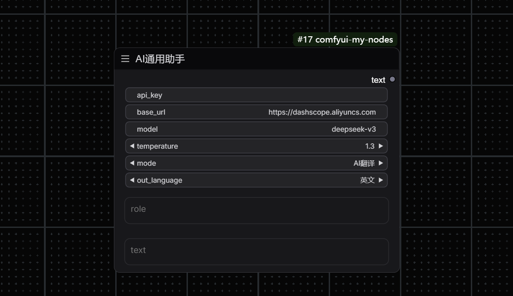
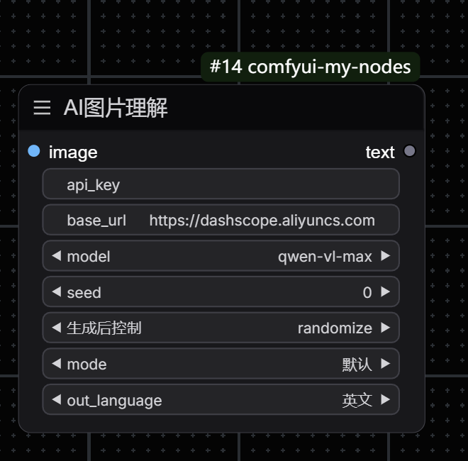
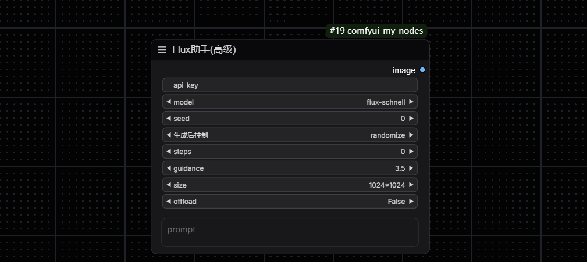
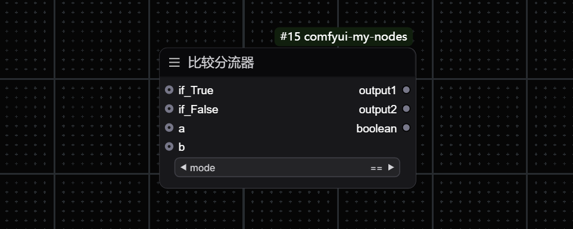
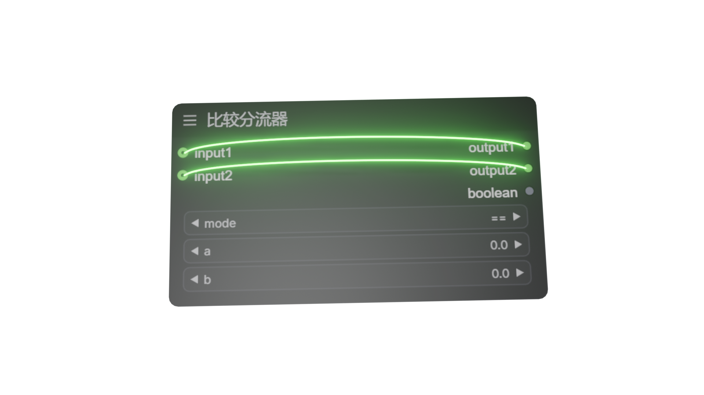
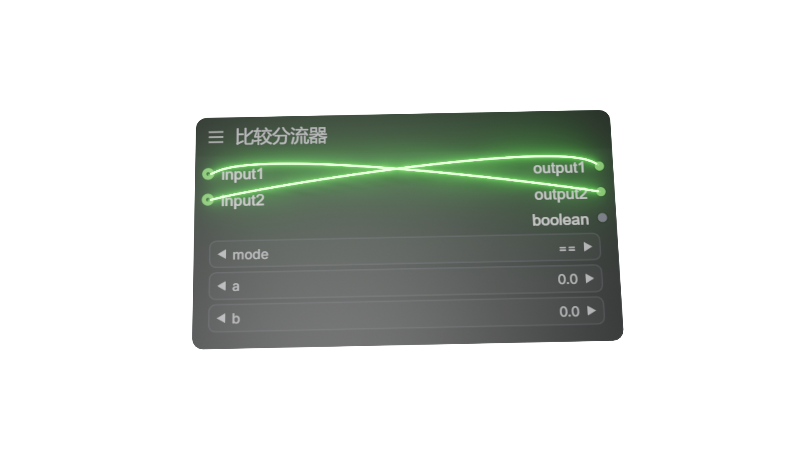
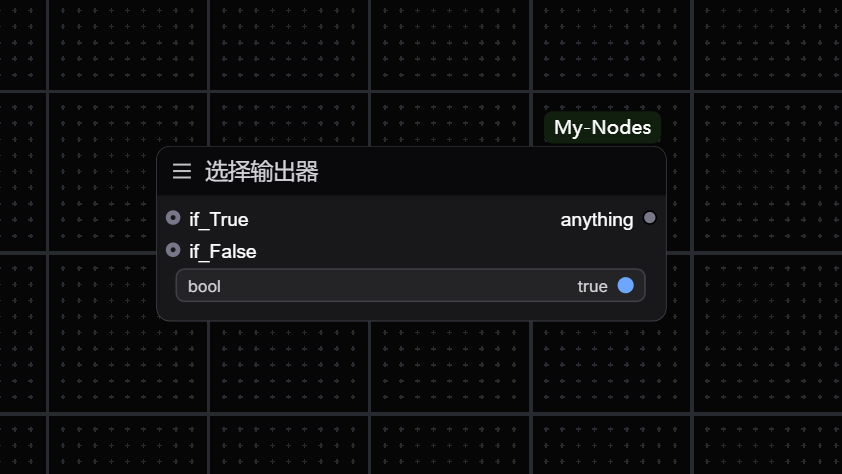
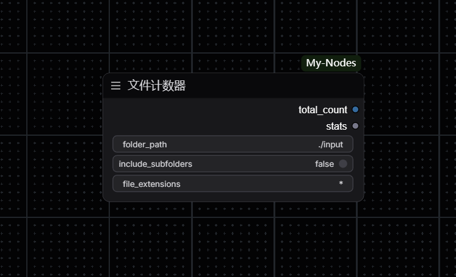
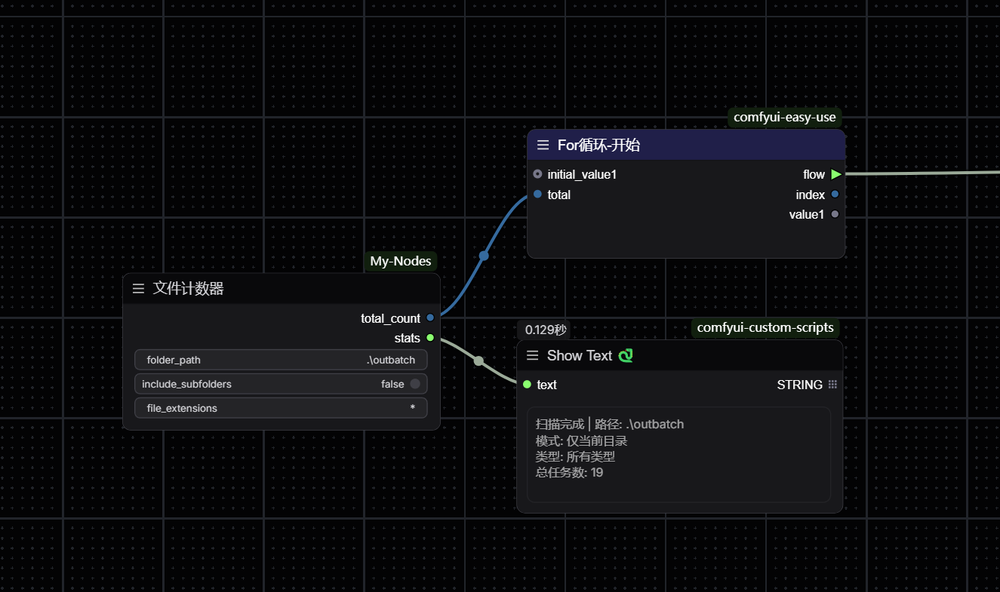

# My-Nodes

AI助手
(正在测试...)

## 📑 API获取方法
- 阿里百炼大模型-技术文档

`https://help.aliyun.com/zh/model-studio/getting-started/what-is-model-studio`

- 获取的API可以填写到插件根目录下的配置文件中以通过节点调取（可选）

`../custom_nodes/ComfyUI-My-Nodes/config.txt`

`api_key=YourApiKey`

将 '=' 后替换为你的api_key

- 默认base_url

`https://dashscope.aliyuncs.com/compatible-mode/v1`

## 📑 列表
- 多模态AI助手
- AI助手
- AI图片理解
- Flux助手
- 比较分流器
- 选择输出器
- 宽高比
- 文件计数器
- 从配置文件获取API

## ✨ 功能
- 列表

- 多模态AI助手

  支持输入 -文本 -图片 -音频 -视频路径
  
  支持输出 -文本 -音频

- AI助手

  通用openai格式

- AI图片理解

- Flux助手

  不消耗电脑性能使用阿里百炼进行flux生图

- 比较分流器

  通过判断来改变输出方向

if true
if false

- 选择输出器

  通过判断来选择输出结果

- 文件计数器

  适用于easyuse插件for循环的索引

