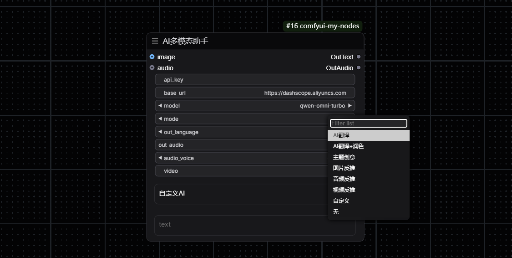
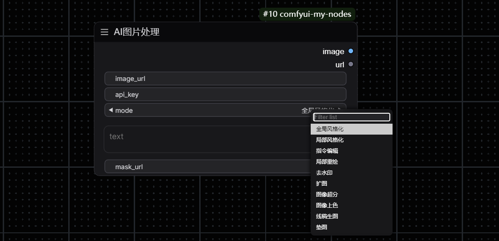
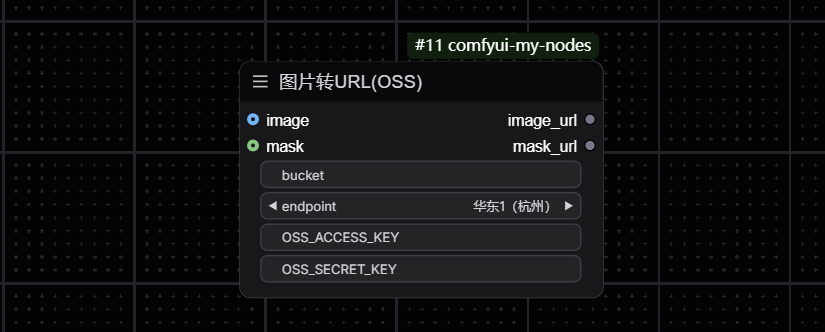
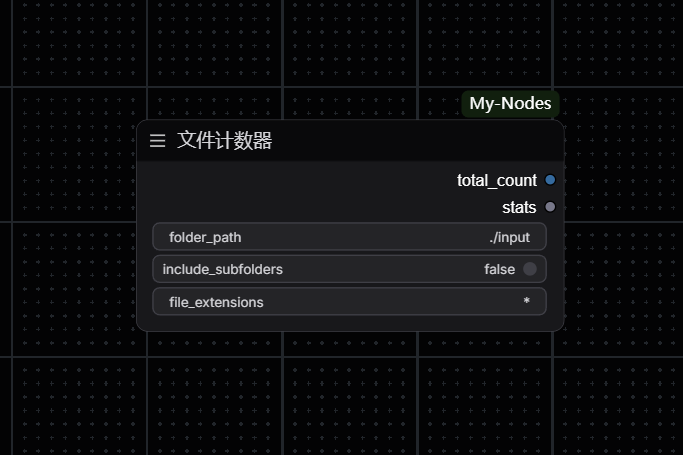
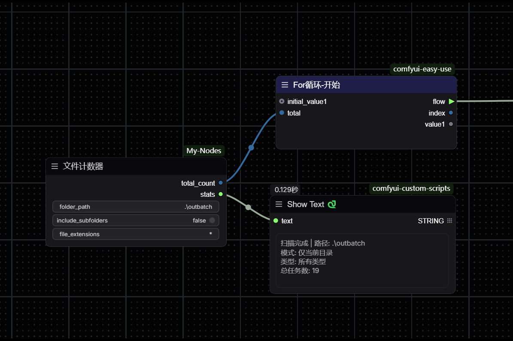

# My-Nodes

AI助手

一个支持在Comfyui中使用阿里百炼Qwen模型API及一些小工具的插件

主要为API及其他工具使用，后续可能会加入本地模型

`preview` 分支为测试版


## 📑 说明书
- 阿里百炼大模型-技术文档

  `https://help.aliyun.com/zh/model-studio/getting-started/what-is-model-studio`


- 如何获取API

  `https://help.aliyun.com/zh/model-studio/user-guide/first-api-call-to-qwen`


- 默认base_url

  `https://dashscope.aliyuncs.com/compatible-mode/v1`


- API填写的三种方式：
  1. 直接输入节点的文本框
  
  3. （推荐）获取的API可以填写到本插件目录下的config.json文件中,通过节点`从配置文件获取数据`调取

      将 ':' 后双引号中的内容替换为你的**api_key**，具体操作细节详见` -功能- >> -从配置文件获取数据- `

  3. 将API写入环境变量
  
      右键此电脑>>属性>>高级系统设置>>高级-环境变量>>下方系统变量中新建
      ```
      变量名：DASHSCOPE_API_KEY
      变量值：你的API
      ```
      **重启comfyui后生效,如未生效可尝试重启电脑或检查输入**

      使用此方法后每次新建节点都会预先填入API

## 🚀 更新内容
- **V1.3.0**

	_添加节点_ `提示词逐行读取`

	_添加节点_ `映射范围`

	_添加节点_ `重置/重复索引`

	_添加节点_ `分离颜色`

	_添加节点_ `合并颜色`

	_添加节点_ `字符串计数/文本框`

	_添加节点_ `浮点/张量转整数`

 	`AI图片理解` _添加提示词框_

  	`AI视频理解` _添加提示词框_
  
- **V1.2.1**

  	_修复部分节点无法无法获取图像URL的问题_

  	_AI多模态助手 模式为‘图片理解’，‘视频理解’，‘音频理解’时，支持输入自定义提示词_

  	_AI多模态助手 更改输出语言描述_
  
- **v1.2.0**

  	注意：此版本 DashScope SDK 版本不低于 1.23.1，如安装过旧版使用以下命令升级，urllib3需保持为1.26.20版本，否则comfyui会发生报错。

	```
 	pip install -U dashscope
	pip install urllib3==1.26.20
	success
	```

	_添加节点_ `AI语音合成`

	_添加节点_ `读取PNG元数据`

	_添加节点_ `写入PNG元数据`

	`AI图片处理` _添加模式指令编辑_

  	_修复节点_ `AI图片理解` _可选模型_

  	_修复节点_ `AI视频理解` _可选模型_

	_修复部分节点无法输出图像的问题_

	_修复部分节点将组件转为输入后没有输入的问题_


## 📠 图片转URL(OSS)（可选节点）

- 使用阿里云OSS对象存储将图片转为URL

- 如何加载该节点
  
  在comfyui命令行界面输入`pip install oss2`后重启即可成功加载节点

- 如何使用该节点
  
  创建对象存储OSS
  
  创建Bucket官方教程
  
  ```https://developer.aliyun.com/adc/tutorial/612670```

  Bucket权限设置
  
  关闭阻止公共访问，读写权限设置为公共读
  
  随后在右上角个人-Accesskey获取节点所需的AccessKey ID及AccessKey Secret


## ❓ 相关问题

- 连接错误：提示`Connection error`，请检查网络连接或IP代理

- 图片反推：如果使用**多模态AI助手**提示`'NoneType' object has no attribute 'is_cuda'`，可以尝试使用**AI图片理解**节点
 
- 图片处理：提示格式错误`InvalidParameter:Value error, format of image is not valid : payload.input.mask_image_url`，将mask_url从控件转换为输入即可

- 视频反推：如果提示`Exceeded limit on max bytes per data-uri item : 10485760`，可能因为视频比特率过高
 
- 网络问题：如发生网络错误，可以尝试关闭梯子或者检查代理
 
- 配置错误：如使用**从配置文件中获取数据**中key显示为`[ERROR] Load config`，请检查config.json中文件格式，如标点符号需使用英文

- 索引过长：使用Flux助手生图时选择schnell模型会提示`list index out of range`，目前暂未处理，可切换dev、merged模型使用


## 🔖 列表
- -----Tools
  
    |----比较分流器
  
    |----选择输出器

    |----宽高比

    |----文件计数器

    |----提示词逐行读取
  
    |----映射范围
  
    |----重置/重复索引
  
    |----字符串计数/文本框
  
    |----浮点/张量转整数
  
    |----分离颜色
  
    |----合并颜色
- -----PngInfo

    |----读取PNG元数据
  
    |----写入PNG元数据

- AI多模态助手
- AI通用助手
- AI图片理解
- AI视频理解
- AI图片处理
- AI语音合成
- Flux助手
- 从配置文件获取数据
- （可选）图片转URL(oss)


## ✨ 功能
_(修改于v1.2.0)_

- **列表**
  
  


- **AI多模态助手**

  支持输入` -文本 -图片 -音频 -视频路径`
  
  支持输出` -文本 -音频`

  


- **AI通用助手**

  支持使用openai的大多数模型，**注意**不同模型的temperature值的上限不同，具体参考使用模型的`技术文档`
  
  


- **AI图片理解**
  
  
  

- **AI视频理解**
  
  


- **AI语音合成**

  


- **AI图片处理**

  


- `可选`**图片转URL(OSS)**

  


- **Flux助手**

  使用阿里百炼进行flux文生图
  
  


- **比较分流器**

  通过判断来改变输出方向
  
  

  --------------------------------------**if true**-------------------------------**if false**---------------------------------------

  


- **选择输出器**

  通过判断来选择输出结果
  
  


- **文件计数器**

  适用于easyuse插件for循环的索引
  
  
  


- **从配置文件获取数据**

  从config.json文件中获取数据(适用于方法2)

  使用文本文档打开
     `路径：./custom_nodes/ComfyUI-My-Nodes/config.json`

     ```json

     {
	"api_key": "YourApiKey",
	"base_url": "https://dashscope.aliyuncs.com/compatible-mode/v1",
	"OSS_ACCESS_KEY": "Your AccessKey ID",
	"OSS_SECRET_KEY": "Your AccessKey Secret",
     "bucket": "Your Bucket Name",
	"Key": "Value"


     }
     ```
  可以将自己需要快速获取的值按照以上示例填入，注意标点符号为英文，不要忘记可能丢失的`","`

  保存后重启comfyui生效（或刷新节点定义后来回切换一次输出项，快捷键为`r`）
